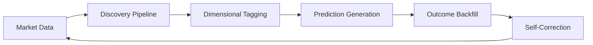

# 🚀 Alpha Engine

[](https://python.org)
[](https://sqlite.org)
[](LICENSE)

> **Research-first foundation for an AI-powered quantitative trading platform**

Alpha Engine is a sophisticated trading system that transforms market data into actionable trading signals through advanced machine learning, dimensional analysis, and automated outcome backfilling.

---

## 🎯 System Overview

### **Core Pipeline**


### **Key Components**
- **📊 Market Data**: Automated price downloads and feature generation
- **🧠 Discovery Pipeline**: Strategy generation and prediction queuing
- **🏷️ Dimensional Tagging**: Axis-based prediction classification
- **📈 Prediction Engine**: Multiple strategy execution
- **🔄 Outcome Backfill**: Automatic real outcome filling
- **🎯 Self-Correction**: Performance-based weight adjustment

---

## ✨ Capabilities

### **🤖 Automated Trading System**
- **Daily Automation**: Market data → predictions → scoring
- **Time-Aligned Learning**: Respects temporal causality
- **Real Outcome Backfill**: Automatic result collection
- **Self-Correcting ML**: Performance-based adaptation
- **Dimensional Analysis**: Multi-axis prediction tagging

### **Strategy Framework**
- **Multiple Strategies**: Silent Compounder, Adaptive, etc.
- **Performance Ranking**: Automatic strategy evaluation
- **Risk Management**: Configurable position sizing
- **Backtesting**: Historical performance validation

### **Enhanced Reporting & Monitoring**
- **Daily Reports**: Strategy performance, system health, and insights
- **Historical Tracking**: Performance trends and comparative analysis
- **System Health**: Database, disk space, and activity monitoring
- **Organized Logging**: Structured logs with automatic rotation
- **Performance Metrics**: CPU, memory, and trading performance tracking

### **Production Features**
- **Task Scheduler Integration**: Automated daily execution
- **Paper Trading Automation**: Alpaca integration for live paper trading
- **Robust Logging**: Comprehensive activity tracking
- **Error Handling**: Graceful failure recovery
- **Database Persistence**: SQLite for development, PostgreSQL ready

---

## 🚀 Quick Start

### **1. Prerequisites**
- **Python 3.9+**
- **Windows** (Task Scheduler integration)
- **Git** (for cloning)

### **2. Setup Instructions**

```bash
# Clone repository
git clone <repository-url>
cd alpha-engine-poc

# Create virtual environment
python -m venv .venv

# Activate virtual environment (Windows)
.venv\Scripts\activate

# Install dependencies
pip install -r requirements.txt
```

### **3. Database Initialization**

```bash
# Initialize database
python -c "
from app.ml.dimensional_tagger import get_dimensional_tagger
tagger = get_dimensional_tagger()
print('Database initialized successfully')
"
```

### **4. Run Locally**

#### **Option A: Manual Trading**
```bash
# Run paper trading simulation
python run_paper_trading.py

# Generate performance report
python run_paper_trading.py --report-only --days 30
```

#### **Option B: Discovery Pipeline**
```bash
# Run discovery and prediction generation
python run_paper_trading.py --discovery

# Compare strategies
python dev_scripts/scripts/compare_discovery_vs_baseline.py
```

#### **Option C: Dimensional System**
```bash
# Test dimensional tagging
python dev_scripts/test_scripts/test_dimensional_tagger.py

# Run outcome backfill
python scripts/auto_backfill_outcomes.py
```

#### **Option D: Paper Trading**
```bash
# Test Alpaca paper trading connection
python dev_scripts/scripts/smoke_test_alpaca.py

# Automated paper trading (after setup)
python scripts/auto_paper_trading.py
```

#### **Option E: Enhanced Reporting & Monitoring**
```bash
# Generate comprehensive daily report
python scripts/generate_daily_report.py

# System monitoring dashboard
python scripts/system_monitor.py

# Performance metrics tracking
python scripts/performance_tracker.py

# Log rotation and cleanup
python scripts/log_rotation.py

# Complete reporting pipeline
run_trading_report.bat
```

---

## Directory Structure

```
alpha-engine-poc/
|-- run_paper_trading.py           # Main trading engine
|-- run_*.bat                     # Task scheduler entrypoints (stubs; see scripts/windows/)
|-- app/                          # Core application modules
|   |-- ml/                        # Machine learning components
|   |   |-- dimensional_tagger.py     # Dimensional tagging system
|   |   |-- outcome_backfill.py      # Automatic outcome filling
|   |-- discovery/                  # Discovery pipeline
|   |-- strategies/                 # Trading strategies
|-- config/                        # Configuration files
|-- data/                          # Database and data files
|-- logs/                          # Organized log structure
|   |-- daily/                     # Daily logs by date
|   |-- weekly/                    # Weekly summaries
|   |-- system/                    # System performance logs
|   |-- trading/                   # Trading activity logs
|   |-- errors/                    # Error logs
|   |-- archive/                   # Rotated/archived logs
|-- reports/                       # Generated reports
|   |-- daily/                     # Daily trading reports
|   |-- weekly/                    # Weekly summaries
|   |-- summaries/                 # Monthly analysis
|-- scripts/                       # Production scripts
|   |-- generate_daily_report.py    # Enhanced daily reporting
|   |-- system_monitor.py          # System monitoring dashboard
|   |-- performance_tracker.py     # Performance metrics
|   |-- log_rotation.py            # Log management
|   |-- setup_organized_logging.py  # Logging structure setup
|-- dev_scripts/                   # Development scripts
|   |-- test_scripts/               # Test scripts
|   |-- ab_test_scripts/            # A/B test scripts
|   |-- utility_scripts/           # Utility scripts
|-- docs/                          # Documentation
```

---

## Production Automation

### **Task Scheduler Setup**

The system includes automated daily execution via Windows Task Scheduler:

```powershell
# Run as Administrator
$dir = "C:\wamp64\www\alpha-engine-poc"

# Task 1 — Download Prices (6:00 AM)
$action = New-ScheduledTaskAction -Execute "$dir\run_download_prices.bat"
$trigger = New-ScheduledTaskTrigger -Weekly -DaysOfWeek Monday,Tuesday,Wednesday,Thursday,Friday -At 6:00AM
Register-ScheduledTask -TaskName "AlphaEngine - Download Prices" -Action $action -Trigger $trigger -RunLevel Highest -Force

# Task 2 — Discovery Pipeline (6:30 AM)
$action = New-ScheduledTaskAction -Execute "$dir\run_discovery_nightly.bat"
$trigger = New-ScheduledTaskTrigger -Weekly -DaysOfWeek Monday,Tuesday,Wednesday,Thursday,Friday -At 6:30AM
Register-ScheduledTask -TaskName "AlphaEngine - Discovery Pipeline" -Action $action -Trigger $trigger -RunLevel Highest -Force

# Task 3 — Replay Score (7:30 AM)
$action = New-ScheduledTaskAction -Execute "$dir\run_replay_score.bat"
$trigger = New-ScheduledTaskTrigger -Weekly -DaysOfWeek Monday,Tuesday,Wednesday,Thursday,Friday -At 7:30AM
Register-ScheduledTask -TaskName "AlphaEngine - Replay Score" -Action $action -Trigger $trigger -RunLevel Highest -Force
```

### **Daily Monitoring**

```bash
# Check system status
python scripts/auto_backfill_outcomes.py

# Generate performance report
run_trading_report.bat

# Verify task execution
type logs\prices.log
type logs\discovery_nightly.log
type logs\replay_score.log
```

---

## 📊 System Features

### **🎯 Dimensional ML System**
- **Axis-Based Tagging**: Environment, sector, model, horizon, volatility, liquidity
- **Performance Tracking**: Real outcome-based metrics
- **Self-Correction**: Automatic weight adjustment
- **Maturity System**: Temporal causality respect

### **🔄 Outcome Backfill**
- **Automatic Price Fetching**: yfinance integration
- **Maturity Tracking**: 7-day horizon respect
- **Database Updates**: Real outcome storage
- **Performance Monitoring**: Daily statistics

### **📈 Performance Analysis**
- **Win Rate Tracking**: Strategy effectiveness
- **Return Analysis**: Profit/loss metrics
- **Axis Performance**: Multi-dimensional evaluation
- **Trend Monitoring**: Performance over time

---

## 🧪 Development

### **Running Tests**
```bash
# Test dimensional system
python dev_scripts/test_scripts/test_dimensional_tagger.py

# Test outcome backfill
python dev_scripts/test_scripts/test_lightweight_dimensional_ml.py

# Run A/B tests
python dev_scripts/ab_test_scripts/adaptive_ab_test.py
```

### **Adding Strategies**
```python
# Create new strategy
from app.strategies.base import BaseStrategy

class CustomStrategy(BaseStrategy):
    def generate_predictions(self, scored_events, market_data):
        # Strategy logic here
        return predictions
```

### **Configuration**
```yaml
# config/default.yaml
strategies:
  - name: "silent_compounder"
    enabled: true
    config:
      ideal_vol: 0.02
      min_return: 0.01
```

---

## 📈 Performance Metrics

### **Current Benchmarks**
- **Data Processing**: <200ms for complex views
- **Prediction Generation**: <500ms for full pipeline
- **Outcome Backfill**: <1s for 100 predictions
- **Database Queries**: <50ms for indexed queries

### **Target Performance**
- **Win Rate**: >58% for advanced strategies
- **Coverage**: >90% outcome completion
- **Self-Correction**: Activates at 90+ outcomes
- **Automation**: 99.9% daily success rate

---

## 🔧 Troubleshooting

### **Common Issues**

#### **Virtual Environment**
```bash
# Ensure activation
call .venv\Scripts\activate

# Verify Python path
where python
```

#### **Database Issues**
```bash
# Check database
sqlite3 data/alpha.db ".tables"

# Reinitialize if needed
rm data/alpha.db
python -c "from app.ml.dimensional_tagger import get_dimensional_tagger; get_dimensional_tagger()"
```

#### **Task Scheduler**
```bash
# Check task status
Get-ScheduledTask -TaskName "AlphaEngine - Download Prices"

# Run manually for testing
Start-ScheduledTask -TaskName "AlphaEngine - Download Prices"
```

---

## 🏗️ Architecture

### **Technology Stack**
- **🐍 Python 3.9+**: Core logic and ML
- **🗄️ SQLite**: Development database
- **📈 yfinance**: Market data source
- **🔧 NumPy/Pandas**: Data processing
- **⏰ Task Scheduler**: Windows automation

### **Design Principles**
- **Time-Aligned**: Respects market timing
- **Fault-Tolerant**: Graceful error handling
- **Performance-Optimized**: Efficient data structures
- **Production-Ready**: Robust automation

---

## 📚 Documentation

- **[Alpaca Automation Guide](ALPACA_AUTOMATION_GUIDE.md)** - Paper trading setup and automation
- **[Development Scripts](dev_scripts/)** - Development tools
- **[CLI Reference](.README.md)** - Detailed command-line interface

---

## 🤝 Contributing

We welcome contributions! Please see `dev_scripts/` for development patterns and testing approaches.

### **Development Setup**
```bash
# Install development dependencies
pip install -r requirements-dev.txt

# Run tests
pytest

# Code formatting
black app/
isort app/
```

---

## 📄 License

This project is licensed under MIT License - see the [LICENSE](LICENSE) file for details.

---

## 🚀 One Sentence Summary

**Alpha Engine is a production-ready quantitative trading system with automated daily execution, dimensional ML analysis, and self-correcting performance adaptation.**

---

<div align="center">

**🚀 Built with ❤️ for quantitative finance and automated trading**

</div>
