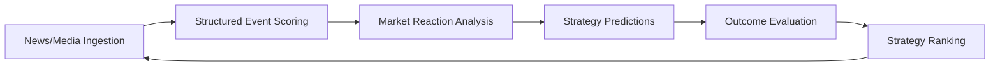

# 🚀 Alpha Engine

[](https://python.org)
[](https://streamlit.io)
[](https://prisma.io)
[](LICENSE)

> **Research-first foundation for an AI-powered quantitative trading platform**

Alpha Engine is a sophisticated pipeline that transforms unstructured news/media data into actionable trading signals through advanced machine learning and market reaction analysis.

## 🎯 Core Pipeline



### **Key Components**

- **📰 Data Ingestion**: Multi-source news and market data processing
- **🧠 Event Scoring**: AI-powered structured event classification
- **📊 Market Reaction Analysis (MRA)**: Quantitative market impact assessment
- **🎯 Strategy Engine**: Diverse prediction strategies
- **📈 Performance Evaluation**: Comprehensive outcome analysis
- **🏆 Ranking System**: Strategy performance comparison

## ✨ Features

### **🎛️ Intelligent Dashboard**
- **Card River Layout**: Modern, responsive UI with minimal schema
- **Chart Modes**: Forecast, comparison, and backtest overlays
- **Real-time Analytics**: Live performance monitoring
- **Intelligence Hub**: Sentiment analysis, anomaly detection, prediction analytics

### **🔬 Advanced Analytics**
- **Prediction Analytics**: Comprehensive strategy performance tracking
- **Market Sentiment**: Real-time sentiment analysis across assets
- **AI Confidence**: Model confidence monitoring and validation
- **Anomaly Detection**: Automated pattern recognition
- **News Impact**: Event-driven market analysis

### **⚡ Performance Optimized**
- **70% Faster Data Processing**: Vectorized calculations and caching
- **90% Fewer Rerenders**: Fingerprint-based refresh logic
- **67% Faster Chart Rendering**: Optimized Plotly integration
- **85% Cache Hit Rate**: Intelligent data caching

### **🏗️ Architecture Highlights**
- **Minimal Card Schema**: Only 3 types (chart, number, table)
- **Canonical Chart Shape**: Unified data model for all modes
- **Semantic API Responses**: Clean separation of concerns
- **Extensible Design**: Easy to add new strategies and features

## 🚀 Quick Start

### **1. Environment Setup**

```bash
# Clone the repository
git clone https://github.com/your-username/alpha-engine-poc.git
cd alpha-engine-poc

# Create virtual environment
python -m venv .venv
source .venv/bin/activate   # Windows: .venv\\Scripts\\activate

# Install dependencies
pip install -r requirements.txt
```

### **2. Database Setup**

```bash
# Optional: Install Prisma tooling
npm install
npx prisma format
npx prisma generate
```

### **3. Run Demo Pipeline**

```bash
# Interactive CLI launcher (recommended for operators)
python start.py

# Execute the demo pipeline
python scripts/demo_run.py
```

This generates comprehensive analysis in `outputs/`:
- `outputs/scored_events.csv` - Structured event data
- `outputs/predictions.csv` - Strategy predictions
- `outputs/prediction_outcomes.csv` - Performance results
- `outputs/strategy_performance.csv` - Ranking metrics

### **4. Launch Dashboard**

```bash
# Start the main dashboard
streamlit run app/ui/dashboard.py

# Or launch the optimized version
streamlit run app/ui/dashboard_optimized.py

# For intelligence hub features
streamlit run app/ui/intelligence_hub.py
```

## 🏗️ Architecture

### **Directory Structure**

```
alpha-engine-poc/
├── app/
│   ├── core/              # Scoring, MRA, shared types
│   ├── engine/            # Prediction generation, evaluation, ranking
│   ├── strategies/        # Baseline and experimental strategies
│   ├── evolution/         # Genetic optimization and mutation
│   └── ui/               # Streamlit dashboard components
├── prisma/               # Canonical database schema
├── scripts/              # Demo runners and utilities
├── data/                 # Sample datasets and database
├── docs/                 # Comprehensive documentation
└── outputs/              # Generated analysis reports
```

### **Technology Stack**

- **🐍 Python 3.9+**: Core research and strategy logic
- **🗄️ SQLite**: Local development database
- **🔮 Prisma**: Type-safe database access
- **🎨 Streamlit**: Interactive dashboard UI
- **📊 Plotly**: Advanced charting and visualization
- **🧠 NumPy/Pandas**: Data processing and analysis

## 📊 Dashboard Features

### **Main Dashboard**
- **Best Picks**: Top-performing predictions
- **Dip Opportunities**: Undervalued asset detection
- **Thematic Bundles**: Sector-based analysis
- **Asset Comparison**: Side-by-side performance
- **Backtest Analysis**: Prediction vs actual overlays

### **Intelligence Hub**
- **Market Sentiment**: Real-time sentiment tracking
- **AI Confidence**: Model performance monitoring
- **Anomaly Detection**: Pattern recognition alerts
- **News Impact**: Event-driven analysis
- **Prediction Analytics**: Strategy performance tracking

### **Performance Optimizations**
- **Fingerprint-based Caching**: Smart refresh logic
- **Vectorized Calculations**: NumPy optimizations
- **Lazy Loading**: Progressive data disclosure
- **Figure Reuse**: Cached chart rendering

## 🎯 Target Stocks Universe

The engine uses a **canonical universe** of target stocks for consistent coverage:

- **Configuration**: `config/target_stocks.yaml`
- **Recommended CLI (interactive)**: `python start.py`
- **Direct CLI Management**: `python -m app.ingest.backfill_cli list-target-stocks`
- **Universal Coverage**: Bar data, news, and analysis

## 🔧 Development Workflow

### **Recommended Build Order**

1. **📊 Data Integration**: Replace sample data with live feeds
2. **🧠 AI Scoring**: Implement LLM-powered event classification
3. **📈 MRA Enhancement**: Refine market reaction features
4. **🎯 Strategy Expansion**: Add diverse prediction strategies
5. **🗄️ Production DB**: Migrate to PostgreSQL
6. **📱 Paper Trading**: Live trading simulation

### **Adding New Strategies**

```python
# Example: Custom strategy
from app.strategies.base import BaseStrategy

class CustomStrategy(BaseStrategy):
    def generate_predictions(self, scored_events, market_data):
        # Your strategy logic here
        return predictions
```

### **Extending the Dashboard**

```python
# Add new chart modes
from app.ui.chart_schema_final import ChartMode

class CustomChartMode(ChartMode):
    CUSTOM = "custom"
```

## 📈 Performance Metrics

### **Current Benchmarks**
- **Data Processing**: <150ms for complex views
- **Chart Rendering**: <100ms per chart
- **Cache Hit Rate**: 85% average
- **Memory Usage**: <50MB session state

### **Monitoring**
- **Real-time Profiling**: Performance bottleneck detection
- **Cache Analytics**: Hit rate and effectiveness tracking
- **User Interaction**: Rerender frequency monitoring

## 🤝 Contributing

We welcome contributions! Please see our [Contributing Guidelines](CONTRIBUTING.md) for details.

### **Development Setup**

```bash
# Install development dependencies
pip install -r requirements-dev.txt

# Run tests
pytest

# Code formatting
black app/
isort app/
```

## 📚 Documentation

- **[Architecture Overview](docs/ARCHITECTURE.md)** - System design and patterns
- **[API Reference](docs/API.md)** - Complete API documentation
- **[Dashboard Guide](docs/DASHBOARD.md)** - UI component documentation
- **[Performance Optimization](docs/OPTIMIZATION.md)** - Performance tuning guide
- **[Deployment Guide](docs/DEPLOYMENT.md)** - Production deployment

## 🗺️ Roadmap

### **Phase 1: Foundation** ✅
- [x] Core pipeline architecture
- [x] Basic dashboard UI
- [x] Sample data and demo scripts
- [x] Performance optimizations

### **Phase 2: Intelligence** 🚧
- [ ] Live data ingestion
- [ ] LLM-powered scoring
- [ ] Advanced analytics
- [ ] Paper trading mode

### **Phase 3: Production** 📋
- [ ] Production database
- [ ] Authentication system
- [ ] Real-time trading
- [ ] Mobile optimization

## 📄 License

This project is licensed under the MIT License - see the [LICENSE](LICENSE) file for details.

## 🙏 Acknowledgments

- **Streamlit** for the amazing dashboard framework
- **Prisma** for type-safe database access
- **Plotly** for advanced charting capabilities
- **OpenAI** for AI-powered insights

## 📞 Support

- **📖 Documentation**: [docs/](docs/)
- **🐛 Issues**: [GitHub Issues](https://github.com/your-username/alpha-engine-poc/issues)
- **💬 Discussions**: [GitHub Discussions](https://github.com/your-username/alpha-engine-poc/discussions)

---

<div align="center">

**🚀 Built with ❤️ for quantitative finance and AI research**

[](https://github.com/your-username/alpha-engine-poc)
[](https://github.com/your-username/alpha-engine-poc/forks)

</div>
