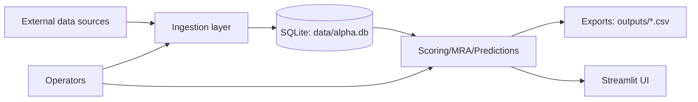

# Security Overview (Internal)

## Purpose
Summarize the threat model and trust boundaries at a level appropriate for an audit baseline.

## Audience
- Security/audit reviewers
- Operators

## When to use this
- You need to reason about trust boundaries, sensitive data handling, and key controls.

## Prereqs
- Familiarity with the repo structure and runtime environment

---

## Scope boundaries
- This document is an audit baseline. It identifies major risks and boundaries, not an exhaustive penetration test.
- Public materials should not include sensitive operational/security details.

## System boundary (conceptual)

## Trust boundaries (practical)
1. **Network boundary (external sources)**:
   - Adapters in `app/ingest/adapters/` may fetch external data using provider keys.
   - Network failures and auth failures should be treated as expected conditions.
2. **Secrets boundary (env + local files)**:
   - Keys are *referenced* via `config/keys.yaml` and resolved from environment variables using `app/ingest/key_manager.py`.
   - `.env` may exist for local dev; it must never be committed.
3. **Local persistence boundary (`data/alpha.db`)**:
   - SQLite may store event text and metadata. Treat this DB as sensitive in shared environments.
4. **UI boundary (Streamlit)**:
   - Streamlit is typically run locally (`streamlit run app/ui/app.py`) but can be deployed.
   - If deployed, you must add auth/access controls and consider data exposure via UI pages (audit views can reveal raw events and ingestion health).
5. **Exports boundary (`outputs/`)**:
   - CSV artifacts can contain content derived from inputs; treat exports as shareable only after review/redaction.

## Key controls (baseline)
- Config-driven ingestion boundaries: sources are explicitly declared in `config/sources.yaml` and validated by `app/ingest/validator.py` (Pydantic schema in `app/ingest/source_spec.py`).
- Validation + dedupe:
  - Validation drops empty/bad timestamps and empty news text (`app/ingest/validator.py`).
  - Dedupe assigns deterministic event IDs (`SHA256(source_id|timestamp|text)`) and drops within-run duplicates (`app/ingest/dedupe.py`).
- Persistence isolation: ingestion writes to local SQLite (`data/alpha.db`) via `app/ingest/event_store.py` using INSERT-OR-IGNORE semantics.
- Key indirection:
  - `app/ingest/key_manager.py` reads `config/keys.yaml`.
  - Values like `ENV:ALPACA_KEY` are resolved from environment variables at runtime.

## Known risks (baseline)
- Secrets management for external integrations:
  - `.env` is best-effort loaded by `start.py` (python-dotenv if installed, otherwise a minimal parser).
  - `config/keys.yaml` controls which env vars are read.
  - Current mismatch: `.env.example` uses `ALPACA_API_KEY`/`ALPACA_API_SECRET`, while `config/keys.yaml` expects `ALPACA_KEY`/`ALPACA_SECRET`. Align before production use.
- Data provenance and timestamp alignment issues that can cause misleading outcomes (mitigate with lineage checks and validation).
- Supply chain risk across Python + npm dependencies.
- Local SQLite can contain event text; treat as sensitive research data in shared environments.

## Minimal threat model (baseline)
- **Accidental secret exposure**: committing `.env`, logging keys, or sharing screenshots of env/config.
- **Unintended data exposure**: deploying Streamlit without auth; exposing audit tables/queries.
- **Integrity risk**: malformed timestamps or extraction mappings causing silent drops or misaligned evaluations.
- **Availability risk**: provider rate limits/timeouts causing ingestion stalls; mitigated via rate limiting and timeouts.

## Verification steps
- Confirm secrets are not committed (review `.env.example` vs `.env`, `.gitignore`)
- Review ingestion validation and dedupe behavior (`ADMIN_GUIDE.md`)
- Confirm reproducibility flow produces deterministic artifacts (`docs/internal/audit/reproducibility.md`)

Practical checks:
- Diagnose adapters + normalization: `python -m app.ingest.diagnose` (set `ALPHA_DIAGNOSE_ALLOW_NETWORK=1` to enable fetch)
- Run a one-shot ingestion pass: `python -m app.ingest.async_runner`
- Confirm SQLite DB exists and is readable: `data/alpha.db`
