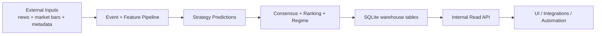

# API, Data Warehouse, and Pipeline Guide (Public)

## Why this document exists

Most API docs tell you only "what endpoint to call."
This guide explains:

- what each API returns,
- how those values are produced,
- how often they refresh,
- where the data lives,
- and where the system is intentionally deep vs intentionally shallow.

If you read this end-to-end, you should understand how Alpha Engine turns raw events and market bars into decisions, and how those decisions appear in API responses.

---

## The system in one picture



---

## What "data warehouse" means here

In this project, the warehouse is a structured SQLite dataset (default `data/alpha.db`) with normalized tables for:

- events (`raw_events`, `scored_events`, `mra_outcomes`)
- models and strategy lifecycle (`strategies`, `strategy_stability`, `strategy_performance`, `promotion_events`)
- prediction lifecycle (`predictions`, `prediction_outcomes`, `prediction_runs`, `prediction_scores`)
- market context (`price_bars`, `regime_performance`, `consensus_signals`, `ranking_snapshots`)
- operations health (`loop_heartbeats`, queue/admission related tables)

The internal read API sits on top of this warehouse and serves "already-computed" views.

---

## Update frequency and freshness model

The platform is primarily daily-batch driven, with optional always-on loops.

Typical cadence (recommended ops schedule):

- discovery pipeline: daily (after close)
- prediction queue runner: daily (right after discovery)
- daily runner: can orchestrate both as one scheduled job
- runtime loops (live/replay/optimizer): optional and environment-dependent

### What this means for API freshness

- Some endpoints are near-real-time if loops are running and writing frequently.
- Most intelligence endpoints are "latest warehouse snapshot" views.
- Daily jobs are the primary source of refresh for rankings, prediction runs, and many aggregates.

---

## API surface (what we expose)

There are two families of endpoints:

1. top-level explainability/ops routes (for ranking and operational context)
2. `/api/*` routes (market reads + recommendations + intelligence views)

### Core market and recommendation reads

- `GET /api/quote/{ticker}`
- `GET /api/history/{ticker}` 
- `GET /api/candles/{ticker}`
- `GET /api/company/{ticker}`
- `GET /api/stats/{ticker}`
- `GET /api/regime/{ticker}`
- `GET /api/recommendations/latest`
- `GET /api/recommendations/best`
- `GET /api/recommendations/{ticker}`
- `GET /api/recommendations/under/{price_cap}`

### Intelligence and system-depth reads

- `GET /api/strategies/catalog`
- `GET /api/strategies/{strategy_id}/stability`
- `GET /api/strategies/{strategy_id}/performance`
- `GET /api/experiments/leaderboard`
- `GET /api/experiments/trends`
- `GET /api/experiments/summary`
- `GET /api/experiments/meta-ranker/latest`
- `GET /api/experiments/meta-ranker/intents/latest`
- `GET /api/experiments/meta-ranker/intents/replay`
- `GET /api/experiments/meta-ranker/promotion-readiness`
- `GET /api/experiments/meta-ranker/alt-data/coverage`
- `GET /api/experiments/meta-ranker/strategy-queue-share`
- `GET /api/performance/regime`
- `GET /api/consensus/signals`
- `GET /api/ticker/{symbol}/attribution`
- `GET /api/ticker/{symbol}/accuracy`
- `GET /api/system/heartbeat`
- `GET /api/system/data-health`
- `GET /api/predictions/runs/latest`
- `GET /api/predictions/{prediction_id}/context`
- `GET /api/engine/calendar`

Plus top-level:

- `GET /health`
- `GET /ranking/top`
- `GET /ranking/movers`
- `GET /ticker/{symbol}/why`
- `GET /ticker/{symbol}/performance`
- `GET /admission/changes`

---

## How values are generated (endpoint-by-endpoint)

## 1) Market shape endpoints

### `/api/quote/{ticker}`

- Source: `price_bars`
- Logic: latest available bar, preferring `1m`, then `1h`, then `1d`
- Refresh behavior: updates whenever new bars are ingested
- Depth: shallow (current state read)

### `/api/history/{ticker}` and `/api/candles/{ticker}`

- Source: `price_bars`
- Logic: parse requested `range` + `interval`, choose timeframe, resample as needed
- Output:
  - history: close-only points
  - candles: OHLCV series
- Refresh behavior: tied directly to latest bar ingestion
- Depth: medium (time-windowed transformations over raw bars)

### `/api/stats/{ticker}`

- Source: mostly `price_bars` + optional company profile metadata
- Logic:
  - latest price
  - day change
  - 52-week high/low style metrics
  - average volume window
  - IPO/listing inference
- Refresh behavior: latest bars + profile data availability
- Depth: medium (derived market summary)

---

## 2) Regime and recommendation endpoints

### `/api/regime/{ticker}`

- Source: daily closes from `price_bars`
- Core method:
  - compute SMA20 and SMA200
  - classify regime:
    - `risk_on` when close >= SMA200
    - `risk_off` otherwise
  - compute `confirmedBars` as consecutive bars agreeing with current regime (capped at 5)
  - return `asOf` as latest bar date used
- Guardrail:
  - requires >= 200 daily bars
  - returns `422` + `{"error":"insufficient_history"}` if not enough data
- Refresh behavior: daily bar updates
- Depth: medium (transparent deterministic regime model)

### `/api/recommendations/*`

- Sources:
  - ranking snapshots
  - consensus signals
  - day momentum from market stats
  - candidate/admission status
  - company profile semantics (name/site/sector/industry/country/employees)
  - quality proxies (years listed, undervaluation vs 52w high, liquidity vs market cap)
- Logic:
  - weighted blend by `mode` (`conservative`, `balanced`, `aggressive`, `long_term`)
  - blend dynamic signal with company-quality signal
  - increase company-quality weight for cheap names:
    - strongest for `<= $2`
    - high for `<= $10`
    - moderate for `<= $100`
  - convert blend score to action (`BUY`/`HOLD`/`SELL`)
  - emit confidence, entry zone, thesis/avoid-if text, horizon
- Under-price view:
  - `GET /api/recommendations/under/{price_cap}` returns top recommendations under a price ceiling
  - defaults to `preference=long_only` and falls back to absolute ranking when no BUY rows exist under the cap
- Ticker view:
  - `GET /api/recommendations/{ticker}` returns `200` with `found=true|false` (no 404 for missing ticker recommendation)
- Refresh behavior: updates as upstream ranking/consensus/admission data updates
- Depth: medium-deep (cross-table composition with policy weighting)

---

## 3) Strategy and model-lifecycle endpoints

### `/api/strategies/catalog`

- Source: `strategies`
- Focus: active strategies, track (`sentiment` vs `quant`), status, champion flag, score fields
- Refresh behavior: updates when strategy lifecycle or scoring updates persist
- Depth: medium (model inventory + health summary)

### `/api/strategies/{strategy_id}/stability`

- Source: `strategy_stability` joined with `strategies`
- Focus: drift lens between backtest accuracy and live accuracy via `stabilityScore`
- Refresh behavior: depends on stability computation cadence
- Depth: deep (model reliability over time, not just point-in-time output)

### `/api/strategies/{strategy_id}/performance`

- Sources:
  - `strategies` (profile + scorecard fields)
  - `strategy_stability` (backtest/live accuracy drift lens)
  - `strategy_performance` (accuracy + avg return by horizon)
- Focus:
  - one merged object for strategy-level performance inspection
  - includes:
    - strategy metadata (`name`, `version`, `track`, `status`, champion/active flags)
    - scorecard (`backtestScore`, `forwardScore`, `liveScore`, `stabilityScore`, `sampleSize`)
    - stability block (same shape as `/stability`)
    - performance block:
      - `latest` horizon snapshot
      - `byHorizon[]` rows (`horizon`, `accuracy`, `avgReturn`, `updatedAt`)
    - lifecycle timestamps
- Why it matters: provides a single strategy-performance read without client-side endpoint stitching
- Refresh behavior: updates as strategy scoring/stability/performance aggregation writes persist
- Depth: deep (merged strategy profile + reliability + realized performance signal)

### `/api/experiments/leaderboard`, `/api/experiments/trends`, `/api/experiments/summary`

- Source: `experiment_results` (ML/deterministic run metrics) plus strategy rollups used by read models
- Focus:
  - compare deterministic strategies and ML challengers on shared horizons (`5d`, `20d`)
  - expose rank ordering, time-series movement, and compact mover summaries
- Why it matters: single experiment comparison layer without client-side metric stitching
- Refresh behavior: updates when experiment runs write results
- Depth: deep (cross-experiment performance lifecycle)

### `/api/experiments/meta-ranker/latest`

- Source: `prediction_queue.metadata_json` (`ml_challenger` block)
- Focus:
  - latest challenger scoring output (`baseScore`, `pOutperform`, `pFail`, `finalRankScore`)
  - penalties (`crowdingPenalty`, `regimeMismatchPenalty`)
  - strategy attribution on each symbol (`strategy`)
- Refresh behavior: updates as nightly challenger shadow run writes queue metadata
- Depth: deep (symbol-level challenger explainability)

### `/api/experiments/meta-ranker/intents/latest` and `/api/experiments/meta-ranker/intents/replay`

- Source:
  - latest: `trade_intents`
  - replay: `trade_intents` joined to realized outcomes (`discovery_outcomes`)
- Focus:
  - deterministic entry/exit intent contracts generated from challenger selections
  - replay lens on realized outcomes versus intended trades
- Why it matters: transparent challenger-to-realized path for audit and promotion decisions
- Refresh behavior: updates as new challenger runs create intents and as outcomes mature
- Depth: deep (intent provenance + realized validation)

### `/api/experiments/meta-ranker/promotion-readiness`

- Source: latest challenger `experiment_results.metadata_json` gates and realized label rollups
- Focus:
  - consolidated gate card (`data_quality`, sample readiness, threshold, significance, promoted flag)
  - one operational decision payload (`ready`, `reason`, gate details)
- Why it matters: avoids manual gate reconstruction across multiple datasets
- Refresh behavior: updates when challenger runs write promotion metadata and realized labels refresh
- Depth: deep (governance and promotion control plane)

### `/api/experiments/meta-ranker/alt-data/coverage`

- Source:
  - `alt_data_daily` grouped by `as_of_date` and `source`
  - recent challenger `experiment_results` metadata (`alt_data`, `alt_data_ingest`)
- Focus:
  - per-day/per-source symbol counts and average quality
  - run-level ingestion diagnostics (`written`, `requested_symbols`, `coverage`, `mode`)
- Why it matters: compare low-cost alt-data mode quality before judging alpha impact
- Refresh behavior: updates when ingestion writes `alt_data_daily` and challenger runs persist metadata
- Depth: medium-deep (data quality and readiness lens)

### `/api/experiments/meta-ranker/strategy-queue-share`

- Source: `prediction_queue.metadata_json`
- Focus:
  - strategy attribution share in current queue (`count`, `share`)
  - queue routing context by strategy (`queue_paths` breakdown such as `watchlist`, `diversity_topup`)
- Why it matters: verifies multi-strategy intake is operationally represented in queued candidates
- Refresh behavior: updates whenever queue assembly writes/updates metadata
- Depth: medium-deep (routing diversity observability)

### `/api/performance/regime`

- Source: `regime_performance`
- Focus: aggregated prediction count, accuracy, avg return per regime
- Refresh behavior: updates when outcome/performance aggregation runs
- Depth: medium-deep (regime-aware effectiveness)

---

## 4) Consensus and attribution endpoints

### `/api/consensus/signals`

- Source: `consensus_signals`
- Logic:
  - latest snapshot per ticker
  - optional threshold filtering via `min_p_final`
  - expose overlap details (`sentimentScore`, `quantScore`, `agreementBonus`, `pFinal`)
- Refresh behavior: updates when consensus writer runs
- Depth: deep (cross-track agreement quality)

### `/api/ticker/{symbol}/attribution`

- Source: `scored_events`
- Focus:
  - category, materiality, direction, confidence
  - semantic evidence (`conceptTags`, `explanationTerms`)
- Refresh behavior: updates as event scoring writes new rows
- Depth: deep (human-readable "why" signals exist)

### `/api/ticker/{symbol}/accuracy`

- Source: `prediction_outcomes` joined to `predictions`
- Focus:
  - directional hit-rate
  - average residual alpha
  - sample count
- Refresh behavior: updates only when outcomes are evaluated
- Depth: deep (truth-calibrated quality, not just forecast intent)

---

## 5) Operations and freshness endpoints

### `/api/system/heartbeat`

- Source: `loop_heartbeats`
- Focus: latest status per loop type (`live`, `replay`, `optimizer`)
- Why it matters: lets users distinguish "no signal" from "pipeline not running"
- Refresh behavior: loop-driven, often frequent if runtime is enabled
- Depth: shallow-medium (operational liveness)

### `/api/system/data-health`

- Source: SQLite active universe + `fundamentals_snapshot` + on-disk `company_profiles` + `predictions`, plus `reports/pipeline-last-status.txt` when present
- Focus: one JSON object with `overall`, per-layer `status` (`OK` / `WARN` / `FAIL`), `summary` line, and `last_run` (from pipeline sentinel)
- Why it matters: fastest “is the warehouse alive” check for ops dashboards
- Refresh behavior: read-only, always current DB state
- Depth: shallow (thresholds align with `fresh_bar_coverage` SLA and simple coverage ratios)

### `/api/predictions/runs/latest`

- Source: `prediction_runs`
- Focus:
  - ingress and prediction timing windows
  - latest run id/timeframe/regime
  - run trust layer: `runStatus`, `runQuality`, machine-readable `degradedReasons`
  - operational diagnostics: latency/staleness and coverage (`coverageRatio`)
- Why it matters: direct recency check for batch freshness
- Refresh behavior: updates when each prediction batch completes
- Depth: medium (pipeline observability)

### `/api/predictions/{prediction_id}/context`

- Source: `predictions`
- Focus:
  - row-level prediction traceability by id
  - includes strategy + scoring context fields used downstream:
    - prediction metadata (`ticker`, `timestamp`, `prediction`, `confidence`, `horizon`, `mode`)
    - ranking-linked fields (`rankScore`, `rankingContext`)
    - feature snapshot context (`featureSnapshot`)
- Why it matters: lets consumers/auditors inspect the exact context behind one prediction record
- Refresh behavior: immutable per prediction row once written (unless explicitly rewritten by pipeline jobs)
- Depth: deep (per-record explainability substrate)

### `/api/engine/calendar`

- Source: merged current-month rows from `predictions`, `ranking_snapshots`, `consensus_signals`
- Query:
  - `month=YYYY-MM` (optional; request month is accepted but response is always served for current UTC month)
  - `limit` (default 50, max 500)
  - `distribution=actual|uniform` (default `actual`; `uniform` spreads returned events across month days for UI calendars)
  - `min_days` (default 12; target day spread when `distribution=uniform`)
- Focus:
  - unified event feed for consumer calendars in one call
  - each event shape:
    - `date`, `type` (`prediction|ranking|consensus`), `symbol`, `predictionId`, `direction` (`BUY|HOLD|SELL`), `confidence`, `source`
  - includes summary metadata:
    - `eventCount`, `minimumExpected` (10), `meetsMinimum`, `countsByType`
    - `distinctDays`, `minimumDaysTarget`, `meetsDayTarget`
    - `requestedMonth`, `servedMonth`, `requestAdjustedToCurrentMonth`
- Why it matters: replaces multi-endpoint stitching with one normalized calendar contract
- Refresh behavior: updates as underlying prediction/ranking/consensus writers persist rows during the month
- Depth: medium-deep (cross-source merge normalized for UI consumption)

### `/ranking/top`

- Source:
  - latest `ranking_snapshots`
  - recent per-ticker rank stability
  - latest run health
  - nearest ranked `predictions` row context (`rank_score`, `ranking_context_json`, strategy metrics lookups)
- Focus:
  - base ranking rows (`score`, `conviction`, attribution)
  - explicit interpretation contract:
    - `rankingKind="relative_priority"`
    - `notActionable=true`
    - `rank` and `peerCount`
    - `drivers[]`, `risks[]`, `changes[]`
  - `edgeScore` (score + conviction + low fragility, adjusted by run quality)
  - `fragilityScore` (stability of ranking score over recent snapshots)
  - factor metadata:
    - `factorVersion`
    - `scoreBreakdown` (rank-score component weights)
    - `subDrivers` (model accuracy, avg return, live score, stability, temporal multiplier, regime-fit proxy, raw rank score)
  - rank-native interpretation block:
    - `rankContext.basis[]` (peer-relative basis for current position)
    - `rankContext.timing[]` (what changed snapshot-over-snapshot)
    - `rankContext.risks[]` + `rankContext.invalidators[]` (current risk + break conditions)
    - `rankContext.scope` (window + peer-basis metadata)
    - lifecycle summary fields:
      - `status`, `horizon`, `fit`, `durability`, `freshness`
      - `spread`, `pressure`, `trigger`, `history`
  - cross-endpoint bridge fields (`rankedUnderDegradedRun`, `runStatus`, `runQuality`)
- Query options:
  - `maxFragility` in `[0.0, 1.0]` to pre-filter unstable names server-side
- Why it matters:
  - rankings are now inspectable rather than mystical
  - clients can render simple badges or advanced factor tables from the same payload
  - contract makes clear this endpoint is ranking context, not execution intent
  - consumer-facing narratives can be built directly from rank-context statements
- Depth: deep (ranking + trust synthesis + factor diagnostics)

#### Example row shape (abbreviated)

```json
{
  "ticker": "NVDA",
  "rankingKind": "relative_priority",
  "notActionable": true,
  "rank": 1,
  "peerCount": 50,
  "score": 0.82,
  "edgeScore": 0.79,
  "drivers": [],
  "risks": [],
  "changes": [],
  "scoreBreakdown": {
    "confidence": 0.35,
    "accuracy": 0.2,
    "avgReturn": 0.2,
    "liveScore": 0.15,
    "stability": 0.1
  },
  "subDrivers": {
    "modelAccuracy": 0.61,
    "avgReturn": 0.0123,
    "liveScore": 0.72,
    "stabilityScore": 0.58,
    "temporalMultiplier": 1.08,
    "regimeFit": 0.9
  },
  "rankContext": {
    "basis": [
      "Score is above current peer median by +0.18",
      "Persisted in top 10 for 4/5 recent snapshots"
    ],
    "timing": [
      "Rank improved by 3 since previous snapshot",
      "Score increased by +0.04 snapshot-over-snapshot"
    ],
    "risks": [
      "Fragility is 0.22",
      "Pressure is low",
      "Spread vs next is +0.08"
    ],
    "status": "rising",
    "horizon": "swing",
    "fit": "strong",
    "durability": "high",
    "freshness": "recent",
    "spread": 0.08,
    "pressure": "low",
    "trigger": "rank_up",
    "invalidators": [
      "Rank falls below 15",
      "Fragility exceeds 0.50",
      "Edge score drops below 0.64"
    ],
    "history": [4, 3, 2, 2, 1],
    "scope": {
      "window": 5,
      "cutoff": 10,
      "median": 0.41,
      "edge": 0.18,
      "peers": "ranking_peer_set"
    }
  }
}
```

#### Regime-fit note

- Current `regimeFit` is a normalized proxy derived from temporal adjustment context.
- It is useful for interpretation but is not yet a standalone stored regime-fit metric.

---

## Where we are deep vs shallow

### Deep areas (strong explanatory/diagnostic value)

- consensus overlap (`agreementBonus`, `pFinal`)
- attribution payloads (`conceptTags`, `explanationTerms`)
- stability and regime performance
- measured outcomes (`directionCorrect`, residual alpha)

### Shallow areas (intentionally simple views)

- quote/history/candles are straightforward market reads
- health endpoint is a DB liveness probe
- some "latest snapshot" endpoints do not expose full historical lineage yet

This split is intentional: keep core reads fast/simple while preserving depth in intelligence-specific endpoints.

---

## Security and access model

- Internal-read API uses shared-key header auth: `X-Internal-Key`
- if key is configured, callers must provide it
- local insecure mode is available for development only
- this is private service auth, not end-user product auth

---

## Reliability model and caveats

- No endpoint should be interpreted as a guarantee of return.
- `/ranking/top` is explicitly non-actionable ranking context (`rankingKind=relative_priority`, `notActionable=true`).
- Confidence-like values are model outputs, not certainties.
- Freshness depends on job/loop execution; check heartbeat and latest run endpoints first.
- Missing data is possible in thin-history tickers or before enough outcomes have accrued.

---

## Practical "how to read this API" workflow

For a symbol-level investigation:

1. check `/api/system/data-health` (warehouse + last pipeline line) or `/api/system/heartbeat`
2. check `/api/predictions/runs/latest`
3. get market context via `/api/stats/{ticker}` and `/api/regime/{ticker}`
4. inspect overlap via `/api/consensus/signals?ticker=...`
5. inspect rationale via `/api/ticker/{symbol}/attribution`
6. calibrate trust with `/api/ticker/{symbol}/accuracy`

This sequence gives both "what the engine says now" and "how credible that signal has been historically."

---

## Final takeaway

Alpha Engine's public API layer is not just a feed of predictions.
It is a structured decision surface backed by a warehouse that stores:

- what the model saw,
- what it predicted,
- what happened afterward,
- and how system health and regime context shaped those results.

That combination is what turns raw model output into actionable trading intelligence.
