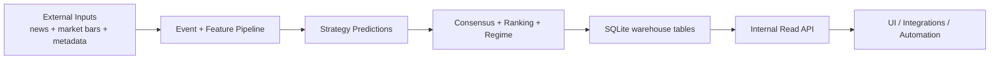

# API, Data Warehouse, and Pipeline Guide (Public)

## Why this document exists

Most API docs tell you only "what endpoint to call."
This guide explains:

- what each API returns,
- how those values are produced,
- how often they refresh,
- where the data lives,
- and where the system is intentionally deep vs intentionally shallow.

If you read this end-to-end, you should understand how Alpha Engine turns raw events and market bars into decisions, and how those decisions appear in API responses.

---

## The system in one picture

---

## What "data warehouse" means here

In this project, the warehouse is a structured SQLite dataset (default `data/alpha.db`) with normalized tables for:

- events (`raw_events`, `scored_events`, `mra_outcomes`)
- models and strategy lifecycle (`strategies`, `strategy_stability`, `strategy_performance`, `promotion_events`)
- prediction lifecycle (`predictions`, `prediction_outcomes`, `prediction_runs`, `prediction_scores`)
- market context (`price_bars`, `regime_performance`, `consensus_signals`, `ranking_snapshots`)
- operations health (`loop_heartbeats`, queue/admission related tables)

The internal read API sits on top of this warehouse and serves "already-computed" views.

---

## Update frequency and freshness model

The platform is primarily daily-batch driven, with optional always-on loops.

Typical cadence (recommended ops schedule):

- discovery pipeline: daily (after close)
- prediction queue runner: daily (right after discovery)
- daily runner: can orchestrate both as one scheduled job
- runtime loops (live/replay/optimizer): optional and environment-dependent

### What this means for API freshness

- Some endpoints are near-real-time if loops are running and writing frequently.
- Most intelligence endpoints are "latest warehouse snapshot" views.
- Daily jobs are the primary source of refresh for rankings, prediction runs, and many aggregates.

---

## API surface (what we expose)

There are two families of endpoints:

1. top-level explainability/ops routes (for ranking and operational context)
2. `/api/*` routes (market reads + recommendations + intelligence views)

### Core market and recommendation reads

- `GET /api/quote/{ticker}`
- `GET /api/history/{ticker}`
- `GET /api/candles/{ticker}`
- `GET /api/company/{ticker}`
- `GET /api/stats/{ticker}`
- `GET /api/regime/{ticker}`
- `GET /api/recommendations/latest`
- `GET /api/recommendations/best`
- `GET /api/recommendations/{ticker}`
- `GET /api/recommendations/under/{price_cap}`

### Intelligence and system-depth reads

- `GET /api/strategies/catalog`
- `GET /api/strategies/{strategy_id}/stability`
- `GET /api/performance/regime`
- `GET /api/consensus/signals`
- `GET /api/ticker/{symbol}/attribution`
- `GET /api/ticker/{symbol}/accuracy`
- `GET /api/system/heartbeat`
- `GET /api/predictions/runs/latest`

Plus top-level:

- `GET /health`
- `GET /ranking/top`
- `GET /ranking/movers`
- `GET /ticker/{symbol}/why`
- `GET /ticker/{symbol}/performance`
- `GET /admission/changes`

---

## How values are generated (endpoint-by-endpoint)

## 1) Market shape endpoints

### `/api/quote/{ticker}`

- Source: `price_bars`
- Logic: latest available bar, preferring `1m`, then `1h`, then `1d`
- Refresh behavior: updates whenever new bars are ingested
- Depth: shallow (current state read)

### `/api/history/{ticker}` and `/api/candles/{ticker}`

- Source: `price_bars`
- Logic: parse requested `range` + `interval`, choose timeframe, resample as needed
- Output:
  - history: close-only points
  - candles: OHLCV series
- Refresh behavior: tied directly to latest bar ingestion
- Depth: medium (time-windowed transformations over raw bars)

### `/api/stats/{ticker}`

- Source: mostly `price_bars` + optional company profile metadata
- Logic:
  - latest price
  - day change
  - 52-week high/low style metrics
  - average volume window
  - IPO/listing inference
- Refresh behavior: latest bars + profile data availability
- Depth: medium (derived market summary)

---

## 2) Regime and recommendation endpoints

### `/api/regime/{ticker}`

- Source: daily closes from `price_bars`
- Core method:
  - compute SMA20 and SMA200
  - classify regime:
    - `risk_on` when close >= SMA200
    - `risk_off` otherwise
  - compute `confirmedBars` as consecutive bars agreeing with current regime (capped at 5)
  - return `asOf` as latest bar date used
- Guardrail:
  - requires >= 200 daily bars
  - returns `422` + `{"error":"insufficient_history"}` if not enough data
- Refresh behavior: daily bar updates
- Depth: medium (transparent deterministic regime model)

### `/api/recommendations/*`

- Sources:
  - ranking snapshots
  - consensus signals
  - day momentum from market stats
  - candidate/admission status
  - company profile semantics (name/site/sector/industry/country/employees)
  - quality proxies (years listed, undervaluation vs 52w high, liquidity vs market cap)
- Logic:
  - weighted blend by `mode` (`conservative`, `balanced`, `aggressive`, `long_term`)
  - blend dynamic signal with company-quality signal
  - increase company-quality weight for cheap names:
    - strongest for `<= $2`
    - high for `<= $10`
    - moderate for `<= $100`
  - convert blend score to action (`BUY`/`HOLD`/`SELL`)
  - emit confidence, entry zone, thesis/avoid-if text, horizon
- Under-price view:
  - `GET /api/recommendations/under/{price_cap}` returns top recommendations under a price ceiling
  - defaults to `preference=long_only` and falls back to absolute ranking when no BUY rows exist under the cap
- Refresh behavior: updates as upstream ranking/consensus/admission data updates
- Depth: medium-deep (cross-table composition with policy weighting)

---

## 3) Strategy and model-lifecycle endpoints

### `/api/strategies/catalog`

- Source: `strategies`
- Focus: active strategies, track (`sentiment` vs `quant`), status, champion flag, score fields
- Refresh behavior: updates when strategy lifecycle or scoring updates persist
- Depth: medium (model inventory + health summary)

### `/api/strategies/{strategy_id}/stability`

- Source: `strategy_stability` joined with `strategies`
- Focus: drift lens between backtest accuracy and live accuracy via `stabilityScore`
- Refresh behavior: depends on stability computation cadence
- Depth: deep (model reliability over time, not just point-in-time output)

### `/api/performance/regime`

- Source: `regime_performance`
- Focus: aggregated prediction count, accuracy, avg return per regime
- Refresh behavior: updates when outcome/performance aggregation runs
- Depth: medium-deep (regime-aware effectiveness)

---

## 4) Consensus and attribution endpoints

### `/api/consensus/signals`

- Source: `consensus_signals`
- Logic:
  - latest snapshot per ticker
  - optional threshold filtering via `min_p_final`
  - expose overlap details (`sentimentScore`, `quantScore`, `agreementBonus`, `pFinal`)
- Refresh behavior: updates when consensus writer runs
- Depth: deep (cross-track agreement quality)

### `/api/ticker/{symbol}/attribution`

- Source: `scored_events`
- Focus:
  - category, materiality, direction, confidence
  - semantic evidence (`conceptTags`, `explanationTerms`)
- Refresh behavior: updates as event scoring writes new rows
- Depth: deep (human-readable "why" signals exist)

### `/api/ticker/{symbol}/accuracy`

- Source: `prediction_outcomes` joined to `predictions`
- Focus:
  - directional hit-rate
  - average residual alpha
  - sample count
- Refresh behavior: updates only when outcomes are evaluated
- Depth: deep (truth-calibrated quality, not just forecast intent)

---

## 5) Operations and freshness endpoints

### `/api/system/heartbeat`

- Source: `loop_heartbeats`
- Focus: latest status per loop type (`live`, `replay`, `optimizer`)
- Why it matters: lets users distinguish "no signal" from "pipeline not running"
- Refresh behavior: loop-driven, often frequent if runtime is enabled
- Depth: shallow-medium (operational liveness)

### `/api/predictions/runs/latest`

- Source: `prediction_runs`
- Focus:
  - ingress and prediction timing windows
  - latest run id/timeframe/regime
  - run trust layer: `runStatus`, `runQuality`, machine-readable `degradedReasons`
  - operational diagnostics: latency/staleness and coverage (`coverageRatio`)
- Why it matters: direct recency check for batch freshness
- Refresh behavior: updates when each prediction batch completes
- Depth: medium (pipeline observability)

### `/ranking/top`

- Source: latest `ranking_snapshots` + recent per-ticker rank stability + latest run health
- Focus:
  - base ranking rows (`score`, `conviction`, attribution)
  - `edgeScore` (score + conviction + low fragility, adjusted by run quality)
  - `fragilityScore` (stability of ranking score over recent snapshots)
  - cross-endpoint bridge fields (`rankedUnderDegradedRun`, `runStatus`, `runQuality`)
- Query options:
  - `maxFragility` in `[0.0, 1.0]` to pre-filter unstable names server-side
- Why it matters: shifts ranking from descriptive ordering to trading-quality ordering
- Depth: medium-deep (ranking + trust synthesis)

---

## Where we are deep vs shallow

### Deep areas (strong explanatory/diagnostic value)

- consensus overlap (`agreementBonus`, `pFinal`)
- attribution payloads (`conceptTags`, `explanationTerms`)
- stability and regime performance
- measured outcomes (`directionCorrect`, residual alpha)

### Shallow areas (intentionally simple views)

- quote/history/candles are straightforward market reads
- health endpoint is a DB liveness probe
- some "latest snapshot" endpoints do not expose full historical lineage yet

This split is intentional: keep core reads fast/simple while preserving depth in intelligence-specific endpoints.

---

## Security and access model

- Internal-read API uses shared-key header auth: `X-Internal-Key`
- if key is configured, callers must provide it
- local insecure mode is available for development only
- this is private service auth, not end-user product auth

---

## Reliability model and caveats

- No endpoint should be interpreted as a guarantee of return.
- Confidence-like values are model outputs, not certainties.
- Freshness depends on job/loop execution; check heartbeat and latest run endpoints first.
- Missing data is possible in thin-history tickers or before enough outcomes have accrued.

---

## Practical "how to read this API" workflow

For a symbol-level investigation:

1. check `/api/system/heartbeat`
2. check `/api/predictions/runs/latest`
3. get market context via `/api/stats/{ticker}` and `/api/regime/{ticker}`
4. inspect overlap via `/api/consensus/signals?ticker=...`
5. inspect rationale via `/api/ticker/{symbol}/attribution`
6. calibrate trust with `/api/ticker/{symbol}/accuracy`

This sequence gives both "what the engine says now" and "how credible that signal has been historically."

---

## Final takeaway

Alpha Engine's public API layer is not just a feed of predictions.
It is a structured decision surface backed by a warehouse that stores:

- what the model saw,
- what it predicted,
- what happened afterward,
- and how system health and regime context shaped those results.

That combination is what turns raw model output into actionable trading intelligence.
